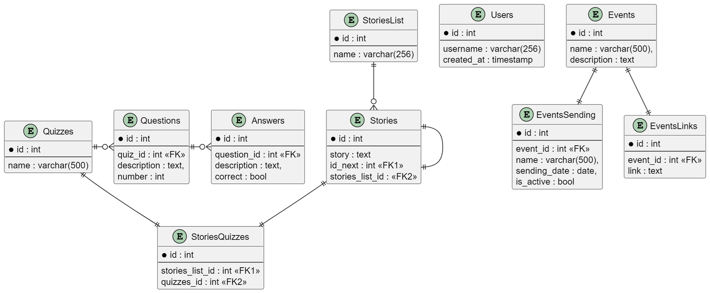

## Телеграм-бот, который расскажет историю IT в XX веке

### Функционал:

При старте бот расскажет о нескольких важных событиях, произошедших в мире IT в XX веке. После этого можно будет пройти квиз по изученному материалу.
Бот будет присылать 

### Использумые технологии

Aiogram, Postgresql

### Схема базы данных

### Идеи по развитию

Сейчас это MVP, функционала не так много. В дальнейшем можно будет его наращивать: например, добавлять рассказы о событиях и квизы к ним, начислять баллы за пройденные квизы и на их основе составлять рейтинги
